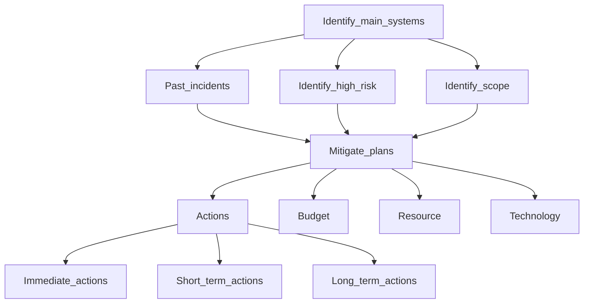

# Welcome to My Group Project 👋 - Risk Assessement and Mitigate plan for Transport Company.

## Project Description
:truck: This project aims to identify, assess, and mitigate potential risks for a transport company to ensure safety, efficiency, and compliance with regulations. 

## Table of Contents
- [Project Description](#project-description)
- [Preview screenshots](#preview-screenshots)
- [Table of Contents](#table-of-contents)
- [Evaluation process](#evaluation-process)
- [Mitigation Plan](#mitigation-plan)
- [Contributors](#contributors)
- [Reference](#reference)
- <a href="https://mm.tt/app/map/3353712700?t=0tkkqx3GAU">Mind map link</a>

## Preview screenshots

  
  

## Evaluation process 

## Mitigation Plan
- Provide tactical and time-sensitive actions:
  + Immediate actions
  + Short-term actions
  + Long-term actions
- Mobilize resources.
- Determine budget to meet the needs of the risk:
  + resources
  + Technology
  + Mistakes can happen

For more details, please go to <a href="https://mm.tt/app/map/3353712700?t=0tkkqx3GAU">Mind map link</a>
  
## Contributors
| Member                  |Role                                |
|-------------------------|------------------------------------|
| Dinh Ngoc Quy (Leader) | Presenter, slide designer, mind map designer |
| Nguyen Huu Hau | Presenter, slide designer, heat map designer |
| Tran Tien Dung | Presenter, brainstorming idea, Performing tasks |
| Nguyen Hoang Tuan | Presenter, brainstorming idea, Performing tasks |

## Reference
- https://www.lucidchart.com/blog/risk-assessment-process
- https://safetyculture.com/topics/risk-assessment/
- https://www.sciencedirect.com/topics/computer-science/mitigation-plan

© | 2024 quydinh2363
  

