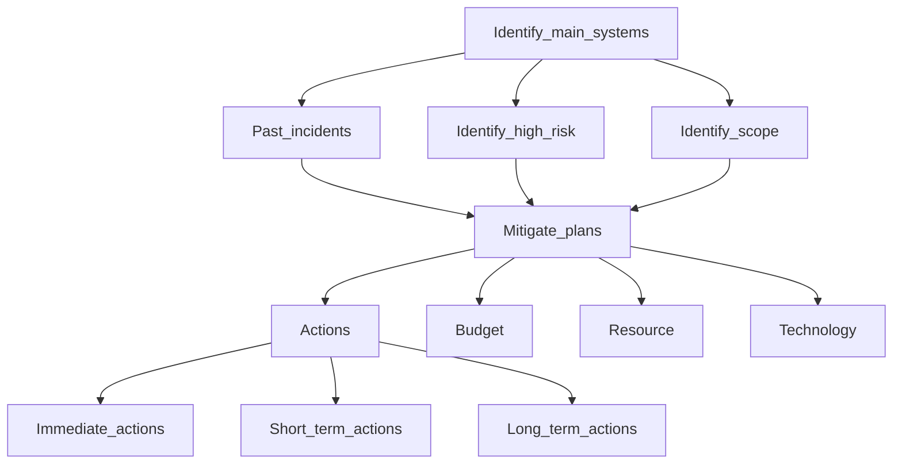

# Welcome to My Group Project 👋 - Risk Assessement and Mitigate plan for Transport Company.

## Project Description
This project aims to identify, assess, and mitigate potential risks for a transport company to ensure safety, efficiency, and compliance with regulations.

## Table of Contents
- [Project Description](#project-description)
- [Preview screenshots](#preview-screenshots)
- [Table of Contents](#table-of-contents)
- [Evaluation process](#evaluation-process)
- [Mitigation Plan](#mitigation-plan)
- [Implementation](#implementation)
- [Contributors](#contributors)
- [Reference](#reference)
- <a href="https://mm.tt/app/map/3353712700?t=0tkkqx3GAU">Mind map link</a>

## Preview screenshots

  
  

  
  

## Evaluation process 

## Mitigation Plan
- Provide tactical and time-sensitive actions:
  . Immediate actions
  . Short-term actions
  . Long-term actions
- Mobilize resources.
- Determine budget to meet the needs of the risk:
  . resources
  . Technology
  . Mistakes can happen
  
## Contributors
| Member                  |Role                                |
|-------------------------|------------------------------------|
| Dinh Ngoc Quy | Presenter, slide designer, mind map designer |
| Nguyen Huu Hau | Presenter, slide designer, heat map designer |

## Reference
- https://www.lucidchart.com/blog/risk-assessment-process
- https://safetyculture.com/topics/risk-assessment/
- https://www.sciencedirect.com/topics/computer-science/mitigation-plan

© | 2024 quydinh2363
  

